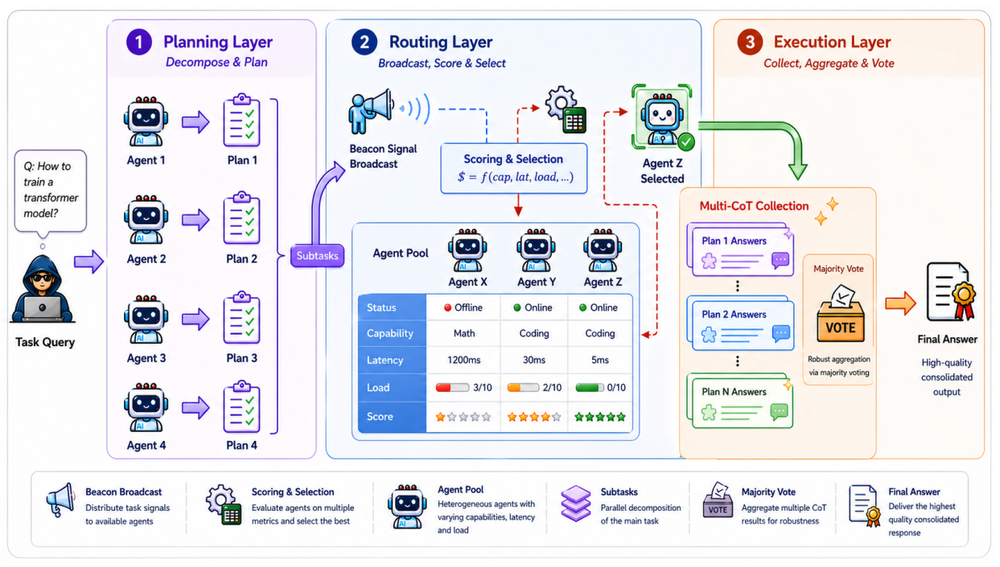

<h1 align="center">
Symphony-Coord
</h1>

<h3 align="center">
Adaptive Routing for Multi-Agent LLM Systems
</h3>

<p align="center">
Agents That Learn Who Should Solve What
</p>

<p align="center">
  <a href="https://arxiv.org/abs/2602.00966">
    
  </a>
  
  
</p>

<p align="center">
  <a href="https://arxiv.org/abs/2602.00966">📄 Paper</a>
  ·
  <a href="https://symphonycoord.ai">🌐 Live Demo</a>
  ·
  <a href="https://github.com/GradientHQ">💡 Ecosystem</a>
</p>


---
## Contents

- [Main Results](#main-results)
- [Overview](#overview)
- [Why Symphony-Coord?](#why-symphony-coord)
- [Demo](#demo)
- [System Architecture](#system-architecture)
- [Quick Start](#quick-start)
- [Reproducing Results](#reproducing-results)
- [Citation](#citation)

---

<p align="center">
  
</p>

<p align="center">
Three-stage coordination pipeline:
Planning → Adaptive Routing → Voting & Aggregation
</p>

---
# Main Results

Symphony-Coord consistently outperforms both single-agent and multi-agent baselines across mathematical reasoning, multi-hop reasoning, and domain-specific QA benchmarks.

Compared with single-agent baselines across evaluated backbones, Symphony-Coord achieves:

| Benchmark | Accuracy Gain |
|------------|------------|
| GSM8K | +8.5 to +22.0 |
| BBH | +16.5 to +23.5 |
| MedicalQA | +27.0 to +33.0 |

Across all evaluated backbones, Symphony-Coord achieves the strongest average performance while remaining robust under heterogeneous agent capabilities and cold-start conditions.

---
# Overview

Symphony-Coord is a decentralized multi-agent LLM framework that formulates adaptive routing as an online contextual bandit problem.

Instead of relying on static expert assignment or handcrafted orchestration policies, Symphony continuously learns routing decisions from interaction outcomes.

The framework consists of three stages:

1. Planning
2. Adaptive Routing
3. Voting & Aggregation

Core mechanisms include:

- beacon-based capability advertisement
- Top-L candidate selection
- LinUCB-based adaptive routing
- reward-driven adaptation
- Chain-of-Thought voting

Through continual feedback, routing policies evolve online and improve coordination quality over time.

---

# Why Symphony-Coord?
Existing multi-agent systems often rely on:

- centralized orchestrators
- static expert assignment
- fixed routing heuristics

However, real-world decentralized systems are inherently dynamic.

Agent capability, latency, availability, and specialization continuously evolve during execution.

Symphony-Coord studies how adaptive routing policies can continuously improve coordination quality under changing execution conditions.

By formulating routing as an online contextual bandit problem, the system learns which agents should solve which tasks while balancing capability, uncertainty, and reward feedback.

---

# Demo

## Video Demo

Explore adaptive routing and emergent specialization in decentralized multi-agent systems.

<p align="center">
  <a href="https://www.youtube.com/watch?v=Qnh4lrXGprE">
    
  </a>
</p>

---

## Interactive Demo

<p align="center">
  <a href="https://symphonycoord.ai">
    
  </a>
</p>

Interactive features include:

- live routing visualization
- evolving specialization dynamics
- decentralized coordination simulation
- adaptive recovery under failure
- multi-agent execution tracing

---

# System Architecture

## 1. Planning

🧩 Task decomposition and candidate plan generation.

Core components:

- task decomposition
- candidate plan generation
- plan selection

---

## 2. Adaptive Routing

🌐 Beacon-guided decentralized coordination.

Core components:

- beacon broadcasting
- capability matching
- Top-L candidate selection
- LinUCB routing
- online reward updates

---

## 3. Voting & Aggregation

🧠 Multi-path reasoning fusion.

Core components:

- parallel Chain-of-Thought execution
- confidence estimation
- voting-based aggregation
- final answer synthesis

---

# Quick Start

## Requirements

* Python 3.10+
* OpenRouter API key

---

## Installation

```bash
git clone https://github.com/GradientHQ/symphony-coord.git
cd symphony-coord

python -m venv venv
source venv/bin/activate

pip install --upgrade pip
pip install -r requirements.txt
pip install -e .
```

Verify installation:

```bash
python -c "import symphony; print('Symphony installed successfully')"
```

---

## Configure API Key

```bash
export OPENROUTER_API_KEY="your-key"
```

Verify API configuration:

```bash
python -c "import os; print('API Key configured' if os.getenv('OPENROUTER_API_KEY') else 'API Key NOT set')"
```

---

## Run Example

```python
from symphony import SymphonyOrchestrator

orchestrator = SymphonyOrchestrator(
    agents=["agent1", "agent2", "agent3"],
    topL=3,
    cot_count=3,
)

result = orchestrator.run_task(
    task_description="Solve: What is 25 * 37?",
    requirements=["math"],
)

print(result["final_answer"])
```

---
# Reproducing Results

This section provides the commands used to reproduce the main experimental results reported in the paper.

## Main Benchmark Results

Run all benchmark evaluations:

```bash
bash experiments/scripts/run_all_datasets.sh
```

Run individual benchmarks:

```bash
bash experiments/scripts/run_gsm8k_pretrain.sh
bash experiments/scripts/run_bbh_pretrain.sh
bash experiments/scripts/run_balanced_pretrain.sh
```

Benchmarks include:

| Benchmark | Task Type              |
| --------- | ---------------------- |
| GSM8K     | Mathematical Reasoning |
| BBH       | Multi-hop Reasoning    |
| MedicalQA | Domain-Specific QA     |

---

## System-Level Experiments

### Exp1: Efficiency & Cost Analysis

```bash
python experiments/exp1/real/exp1_real_openrouter.py --n 2000
```

### Exp2: Robustness & Recovery

```bash
bash experiments/exp2/scripts/run_all_experiments.sh
```

### Exp3: System Optimization

```bash
bash experiments/exp3/run_exp3.sh
```

---

## Generate Paper Figures

```bash
python scripts/plotting/paper_figures/plot_robustness_bars.py
python scripts/plotting/paper_figures/plot_gap_analysis.py
python scripts/plotting/paper_figures/plot_parallel_coordinates.py
```

Additional routing visualizations:

```bash
python scripts/plotting/routing/plot_from_json.py pretrain_results/<result-dir>
python scripts/plotting/routing/plot_agent_donut.py pretrain_results/<result-dir>
```

---

## Detailed Experiment Documentation

For complete experiment configurations, task generation procedures, benchmark preprocessing, troubleshooting, and advanced settings, see:

```text
experiments/README.md
docs/EXPERIMENTS.md
docs/CONFIGS.md
docs/TROUBLESHOOTING.md
docs/OPENROUTER_CONFIG_GUIDE.md
```

---

# Documentation

Detailed setup and experiment guides are available in:

```text
docs/
├── INSTALL.md
├── EXPERIMENTS.md
├── CONFIGS.md
├── TROUBLESHOOTING.md
└── OPENROUTER_CONFIG_GUIDE.md
```

---

# Repository Structure

```text
symphony-coord/
├── agents/                    # Agent implementations
├── core/                      # Routing and coordination algorithms
├── experiments/               # Benchmark and robustness experiments
├── protocol/                  # Task and beacon protocols
├── scripts/                   # Plotting and analysis scripts
├── docs/                      # Documentation
├── tests/                     # Test suite
└── symphony.py                # Main orchestrator
```

---

# Citation

```bibtex
@misc{guan2026symphonycoordadaptiveroutingmultiagent,
      title={Symphony-Coord: Adaptive Routing for Multi-Agent LLM Systems}, 
      author={Zhaoyang Guan and Huixi Cao and Ming Zhong and Yin Wang and Guanyu Liu and Eric Yang and Lynn Ai and Yongxin Ni and Bill Shi},
      year={2026},
      eprint={2602.00966},
      archivePrefix={arXiv},
      primaryClass={cs.MA},
      url={https://arxiv.org/abs/2602.00966}, 
}
```

---

# Acknowledgements

We thank the open-source research community for foundational work in:

* decentralized systems
* online bandit optimization
* multi-agent reasoning
* Chain-of-Thought coordination
* distributed inference systems

---

# License

MIT License
